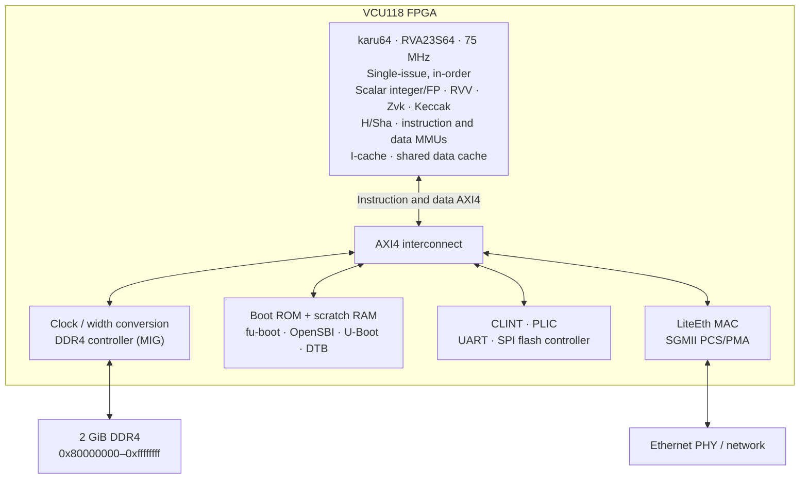

```
   __  ___                    ___
  /  |/  /__ ____  ___ ___   / _ \_______  _______ ___ ___ ___  _______
 / /|_/ / _ `/ _ \(_-</ -_) / ___/ __/ _ \/ __/ -_|_-<(_-</ _ \/ __(_-<
/_/  /_/\_,_/_//_/___/\__/ /_/  /_/  \___/\__/\__/___/___/\___/_/ /___/
    __ __                 _____ __ __
   / //_/___ ________  __/ ___// // /  RVA23S64 Application Processor
  / ,< / __ `/ ___/ / / / __ \/ // /_  Full RVV 1.0 Vector, VLEN=256
 / /| / /_/ / /  / /_/ / /_/ /__  __/  Full Zvbb + Zvk Vector Features
/_/ |_\__,_/_/   \__,_/\____/  /_/     + PQC TG Vector Keccak Extension
```

# karu64

**`karu64`** is an RV64 core and FPGA bring-up tree, implemented in portable Verilog under the permissive BSD 3-Clause license. The Linux baseline is **RVA23S64**, selected by `KARU_RVA23S64`, with RVV 1.0 (VLEN=256), full **Zvbb**, H/Sha virtualization and Sv39 translation. ISA features remain configurable for smaller core builds.

The shipping VCU118 configuration also enables full Zvk vector cryptography and the draft **Zvknhk** Vector Keccak extension (`vkeccak.vi`, RISC-V PQC TG, [riscv/riscv-pqc](https://github.com/riscv/riscv-pqc) `src/zvknhk.adoc`), with CLINT/PLIC interrupts and an NS16550 serial console.

For testing on the [VCU118](https://www.amd.com/en/products/adaptive-socs-and-fpgas/evaluation-boards/vcu118.html) (Xilinx UltraScale+ FPGA) target, we instantiate a SoC with Xilinx DDR4 IP components for 2 GB of memory and [LiteEth/LiteX](https://github.com/enjoy-digital/liteeth) for a basic Gbit Ethernet that supports network boot and a filesystem.

The Linux/rootfs images, DTBs, kernel builds, and deployment artifacts are produced by the companion `karudeb` repository. The core, its flows, and the FPGA SoC are documented under [doc/](doc/) — see the Documentation section below.

The core is split into IFU, decoder, ALU, M (multiply/divide), FPU (single- and double-precision IEEE 754), LSU, CSR/privilege/MMU, register files, and vector execute blocks, all behind AXI4 instruction/data memory ports. The repository also carries freestanding firmware, Verilator and Icarus testbenches, VCU118 FPGA flows, Yosys/OpenSTA NanGate45 flows, and runners for riscv-tests, TestFloat, vector/crypto tests, and OpenSBI/Linux simulation.


## Documentation

- [FPGA bring-up](doc/fpga.md) — VCU118 build/programming instructions,
  UART capture, Linux netboot, memory map and board acceptance.
- [Current diagnostics](doc/release-diagnostics-2026-09-14.md) — September 25
  board results, routed FPGA timing and reference synthesis measurements.
- [doc/architecture.md](doc/architecture.md) — the core micro-architecture:
  pipeline and issue model, functional units, FPU, vector unit, privilege/MMU,
  the build-time configuration knobs, and RVA23 feature coverage.
- [doc/flows.md](doc/flows.md) — build/run flows, the riscv-tests + TestFloat +
  directed vector/Zvk/RVA23 suites, the Linux/SoC sims, and the spike commit-log
  divergence technique.
- [doc/rva23s64-plan.md](doc/rva23s64-plan.md) — supervisor-profile roadmap,
  implemented mandatory features, deliberate limits and remaining release gates.
- [DIEL validation](doc/diel-review-2026-09-14.md) — Zkt/Zvkt and vector
  crypto source audit plus the reproducible shipping-profile latency probe.
- [doc/keccak-throughput.md](doc/keccak-throughput.md) — ideal Verilator
  absorb/squeeze results at SHAKE128/256 rates, changes and validation.
- [doc/keccak-software-comparison.md](doc/keccak-software-comparison.md) —
  reproducible RV64GC / Zbb / vector-enabled C comparisons with the resident
  hardware path (`make keccak-compare`, harness in `test/keccak-sw/`).
- [CHANGELOG.md](CHANGELOG.md) — release notes; the Zvknhk `vkeccak.vi`
  encoding change is a breaking change for software built for the June tree.
 
## Repo layout

    rtl/                    core RTL; top is rtl/karu64.v
      zvk/                  vector-crypto RTL, including the Zvknhk keccak.v /
                            keccak_round.v
    test/fw/                bare-metal firmware and directed firmware tests
                            formerly under drv/
    test/zvk/               SystemVerilog Zvk KAT/decode testbenches
    test/coremark/          CoreMark port files
    test/riscv-tests/       git submodule, upstream riscv-tests
    test/SoftFloat-3e/      Berkeley SoftFloat 3e source
    test/TestFloat-3e/      Berkeley TestFloat 3e source
    flow/                   build/run scripts and linker scripts
      boot/                 VCU118 boot ROM / fu-boot sources
      fpga/                 VCU118 FPGA RTL, constraints, and Vivado Tcl
      syn/                  Yosys/OpenSTA synthesis-estimate flow
    doc/                    architecture, flows, and FPGA documentation
    _build/                 generated artifacts; intentionally gitignored

## Current status

- `KARU_RVA23S64` selects the mandatory RVA23S64 ISA composition plus H,
  Ssstateen and Sscofpmf. The matched-profile ACT4 checkpoint passed
  **2872/2872** tests in both minimal and shipping configurations. The local
  ACT4 dependency patches and exact reproduction flow are documented in
  [test/act4-karu/README.md](test/act4-karu/README.md); configured-suite
  coverage is not a certification claim.
- The current 1W2R FP register-file image (`b11d5efb…3b809`) runs at 75 MHz,
  meets routed timing and passes Linux 7.2.6-zvk board acceptance, including
  memory, cache, crypto and KVM API checks. An on-board FP probe completed;
  full TestFloat3 is running. The previous image passed the KVM guest and
  extended vector ABI suites. Image-specific results are in
  [the diagnostics](doc/release-diagnostics-2026-09-14.md).
- Full Zvbb is cross-checked against Spike by `make zvbb-test-all`. Zvk known
  answers, decode, multi-element-group `.vs` semantics and Keccak are covered
  by the targets in [rtl/zvk/README.md](rtl/zvk/README.md). `make
  diel-test-ship` runs the current shipping-profile Zkt/Zvkt latency probe.
- Yosys area and 200 MHz OpenSTA results are maintained in
  [flow/syn/AREA_MATRIX.md](flow/syn/AREA_MATRIX.md). These standard-cell
  estimates are separate from VCU118 routed timing.
- Generated artifacts are built under `_build`: hello firmware, UART hello, `firmware.hex`, `vcu118_fuboot.hex`, commit logs, Vivado journals/logs, generated IP/project state, reports, checkpoints, and bitstreams.
- VCU118 DDR4 hardware is proven through MIG calibration, DDR memtest, hands-off boot from the bitstream-baked boot ROM, Debian Linux, and LiteEth networking.

## Architecture

### Block diagram

The shipping Linux configuration on VCU118 (`vcu118_ddr_top`):



The scalar and vector load/store units share the data cache and data MMU;
a separate MMU translates instruction fetches. Page-table reads bypass the
I/D caches. Both caches cover the full DRAM range, with MMIO and Svpbmt NC/IO
accesses bypassed. Core pipelines and register files are detailed in
[architecture.md](doc/architecture.md); the board memory map, interrupts and
boot flow are in [fpga.md](doc/fpga.md).

The scalar execution units implement RV64GC (RV64IMAFDC), with FLEN=64
floating-point registers (NaN-boxed singles, raw 64-bit doubles):

- **I**: RV64I integer ALU, loads/stores over a 64-bit data bus, W-suffix
  arithmetic (`addw/subw/sllw/srlw/sraw` and immediate forms)
- **M**: full RV64M — mul, mulh, mulhsu, mulhu, div(u), rem(u), and the
  *W* variants. `karu_m.v` is parameterized by `KARU_M_MUL_CYCLES`
  ∈ {1, 4, 16, 64} (1: combinational `*`; otherwise radix-2^K
  shift-and-add) and `KARU_M_DIV_CYCLES` ∈ {1, 64} (1:
  combinational `/`/`%`; 64 = restoring bit-serial). Synthesis defaults
  to multiply=4/divide=64; `SIM_TB` defaults to 1/1. Serial builds do not
  elaborate the combinational arithmetic operators.
- **F**: IEEE 754 binary32 — fadd/fsub/fmul/fdiv/fsqrt, fmin/fmax,
  fsgnj/n/x, feq/flt/fle, fclass, fmv.x.w / fmv.w.x, all 8 fcvt variants
  (FCVT.{W,WU,L,LU}↔.S), and the four FMA forms (FMADD/FMSUB/FNMSUB/
  FNMADD). f-regs are 64-bit with NaN-boxed singles (upper 32 = all 1s).
  Sub-units have a uniform req/busy/done/result/fflags handshake plus
  a `latency` output so a future pipeline/vector scheduler can reserve
  writeback slots.
- **D**: IEEE 754 binary64 — same op coverage as F (fadd/fsub/fmul/fdiv/
  fsqrt.d, fmin/fmax/fsgnj/feq/flt/fle/fclass/fmv.{x.d,d.x}, all 8
  FCVT.{W,WU,L,LU}↔.D variants, the four FMA forms, plus the two
  cross-precision conversions FCVT.S.D and FCVT.D.S). FLD/FSD wire
  into the existing 64-bit LSU. The decoder produces `fp_is_d` from
  the instruction's fmt field; `karu_fpu` dispatches to D sub-units
  when set and bypasses the NaN-box check (D values use the full 64
  bits raw).
- **A**: LR.{W,D}, SC.{W,D}, and all nine AMOs (swap/add/xor/and/or/min/
  max/minu/maxu) in `.W` and `.D` widths. Implemented in `karu_lsu` as
  a load-then-compute-then-store sequence with an internal ALU; LR/SC
  use a single-bit reservation register (single-core in-order, so
  nothing else races). `aq`/`rl` bits are no-ops.
- **C**: RV64C compressed instructions with the standard RV64 swaps
  (`c.jal`→`c.addiw`, `c.flw/c.fsw` slots→`c.ld/c.sd`, 6-bit shamts,
  `c.addw/c.subw`)
- **Privilege/MMU**: M/S/U-mode support sufficient for OpenSBI and Linux,
  including trap/return paths, delegation, `satp`, and Sv39 translation
  through dual `karu_sv39` instances. Svade requires software to set A/D;
  clear A or a store with clear D raises a page fault, including on TLB hits.
  `menvcfg.ADUE` is read-only zero; optional Svadu hardware updates are absent.
  Unsupported `satp.MODE` writes leave `satp` unchanged. MPRV/MPP selects
  effective data privilege, while fetch uses the actual execution privilege.
  `SFENCE.VMA` and `SINVAL.VMA` invalidate TLB/PWC state and redirect fetch;
  canceled walks drain outstanding reads without refilling either cache.
  Svnapot supports the standard 64 KiB leaf encoding while caching addressed
  4 KiB subpages in the existing TLB.
- **CSRs**: machine/supervisor trap and status CSRs plus `fcsr/frm/fflags`;
  sticky `fflags` are OR'd from FPU op completions. Writable fields reflect
  implemented interrupts, counters and privilege modes; `mip.SEIP` keeps
  software-pending state separate from the external interrupt input.
  PMP is not implemented.
- **Interrupts**: CLINT timer/software and PLIC external interrupt paths are
  wired in the FPGA SoCs, including the VCU118 DDR top. `mip.MSIP` is a
  read-only view of the CLINT input; software sets and clears the source
  through MMIO. The directed interrupt firmware covers masking, delivery,
  clear/rearm, and interrupt draining during vector operations.
  Non-H Sstc adds `stimecmp` and `menvcfg.STCE`; its unsigned 64-bit timer
  comparison is pipelined in two stages. `make sstc-test sstc-test-spike`
  checks direct/legacy delivery and timer CSR permissions.
- **H/Sha virtualization**: enabled by `KARU_RVA23S64`; `KARU_H` provides
  guest CSR/trap state, H memory and
  invalidation instructions, and VS Bare/Sv39 plus G Bare/Sv39x4 translation.
  Bare, cached nonidentity two-stage and virtual-timer monitors pass both
  simulator configurations and the pinned reference; see the
  [H test recipe](doc/flows.md#hypervisor-regressions).
  Software FP/vector/resident-Keccak context switches and directed asynchronous
  preemption pass. The RVA23S64 board configuration boots Linux and passes
  the KVM `ebreak_test` and `arch_timer` guest tests; coverage is recorded in the
  [release diagnostics](doc/release-diagnostics-2026-09-14.md).
- **Vector/crypto**: RVV, full Zvbb, Zvk, and Zvknhk have directed simulation
  coverage. Vector loads/stores use the shared Sv39 DMMU preflight path.
  The VCU118 DDR/SGMII ROM image passes Debian NFS-root board acceptance,
  including 92 OpenSSL known-answer/scalar comparisons and 39 riscv-pqc
  instruction vectors.
- PC is 64-bit internally for Sv39 high-half kernel/user addresses. The
  current FPGA/sim memory maps still place RAM and MMIO in the low 4 GiB.

Optional Ssaia guest-PMU injection is not implemented; see the
[profile status](doc/rva23s64-plan.md) for configuration limits.
(FP is fully IEEE — gradual underflow, subnormal in/out, fused single-rounding
FMA — and vector load/store translates through the shared Sv39 DMMU.)

The top-level core wires together:

- `karu_ifu`: 64-bit AXI4 read-only instruction fetch, two-entry prefetch
  buffering, compressed-instruction realignment, redirects, and stale
  fetch drain after redirects. Its Sv39 request path uses `immu_busy` as the
  missing accept handshake and drops old translation completions after
  redirect/`sfence.vma`.
- `karu_dec` + `karu_rvc64`: RV64I/M/F decode plus RV64C expansion into
  shared unit/sub-op controls. The decoder also produces `rs1_is_f`/
  `rs2_is_f`/`rs3_is_f`/`rd_is_f` flags so the core knows which regfile
  to read/write per op (FMV.W.X reads x → writes f; FMV.X.W the reverse;
  FMA needs rs3 from f; etc.).
- `karu_alu`: integer ALU including RV64 W-ops.
- `karu_m`: M-extension functional unit (see above).
- `karu_lsu`: 64-bit AXI4 load/store unit. Byte/half/word/dword accesses,
  sign/zero extension, byte strobes for stores, split two-beat handling
  for misaligned accesses crossing an 8-byte boundary, and the FLW/FSW
  path that NaN-boxes loads into the f-regfile and pulls store data from
  it.
- `karu_fpu`: F-extension dispatcher. Routes ops to `karu_fmul`,
  `karu_fadd`, `karu_fdiv`, `karu_fsqrt`, `karu_fcvt`, and the
  combinational ops in `karu_fmisc`. FMA is a tiny mul→add sequencer
  with operand latching (the IFU has already advanced by the time the
  add stage runs).
- `karu_csr`: M/S/U CSRs, Sstc timer and fcsr/frm/fflags. FPU op completions
  sticky-OR into fflags.
- `karu_regfile` / `karu_fregfile`: integer and FP register files
  (separate 1W2R files; FP port B also reads FMA's third source at issue).

The implementation is single-issue and in-order, but the code is
structured around explicit front-end, execute, LSU, M, FPU, CSR, and
writeback blocks so it can grow toward deeper pipelining and multi-issue
without keeping everything in one monolithic core file.


## No-Hardware Testing Quick start

Toolchain: a GNU `riscv64-unknown-elf-*` toolchain supporting
`--with-arch=rv64gcv --with-abi=lp64d`, plus `spike`, `iverilog`,
and `verilator` on `$PATH`.

    # clone with submodules (riscv-tests + its env/)
    git clone --recurse-submodules https://github.com/karucore/karu64.git

    # 1. build the hello firmware and run it on spike
    make spike
    # -> prints "[RESET]\n[PASS]\tAll tests ok.\n"

    # 2. simulate the same binary on scalar NO_V karu64 in iverilog
    make htif-sim
    # -> same output; _build/karu.log gets a spike-style commit trace

    # 3. or run it (much faster) under verilator
    make veri

    # 4. crank through the scalar riscv-tests suite
    make test
    # -> PASS: 110   FAIL: 0    TRAP/OTHER: 0

    # 5. drill into a single test or its divergence vs spike
    make test-one  T=rv64ui-p-add
    make test-diff T=rv64um-p-mulh

    # 6. Berkeley TestFloat stress test for the F extension
    make testfloat-build           # one-time
    make fp-test OP=f32_add        # one op, RNE, ~1s
    make fp-test OP=f32_mul RM=rtz # other rounding modes: rne/rtz/rdn/rup/rmm
    make fp-test OP=f32_div RM=dyn FRM=rdn  # DYN: firmware sets fcsr.frm
    make fp-test-regression        # RNE x 36 ops, ~25s with PARALLEL=20
    make fp-test-all               # 5 rounding modes x 36 ops + DYN sanity, ~3 min

### Basic Tests and Berkeley TestFloat

    make test
    # PASS: 110   FAIL: 0    TRAP/OTHER: 0

| Suite       | Tests | Status |
|-------------|------:|--------|
| `rv64ui-p`  |    38 | PASS   |
| `rv64uc-p`  |     1 | PASS   |
| `rv64um-p`  |    13 | PASS   |
| `rv64uf-p`  |    11 | PASS   |
| `rv64ud-p`  |    12 | PASS   |
| `rv64ua-p`  |    19 | PASS   |
| **Total**   | **110** | **all pass under iverilog and verilator** |

The full suite takes ~11s under iverilog, ~1.6s under verilator.

Notable cases worth knowing about:

- `rv64uc-p-rvc`: compressed-instruction fetch across 64-bit fetch
  boundaries.
- `rv64ui-p-ma_data`: misaligned loads/stores crossing an 8-byte
  boundary.
- `rv64uf-p-recoding`: special-case FP arithmetic (-Inf × 3, 0 × 1)
  and the canonical-NaN substitution for non-NaN-boxed values.
- `rv64uf-p-fmadd`: the four FMA forms.
- `rv64uf-p-fcvt_w`: float-to-int saturation for NaN, ±Inf, and
  out-of-range values, signed and unsigned, 32-bit and 64-bit.

Beyond `riscv-tests`, the repo wires up Berkeley TestFloat 3e —
46k+ weighted-random vectors per FP operation across all five RISC-V
rounding modes plus a DYN sanity check (~3 min wall with
`PARALLEL=20`). See [doc/flows.md](doc/flows.md) `#5 Berkeley
TestFloat` for the recipe. The F/D units do full subnormal
normalisation + gradual underflow and report **0 errors** across every
op and rounding mode.

### Architectural tests (ACT4)

Beyond `riscv-tests` and TestFloat, the repo runs **ACT4** — the RISC-V
Architectural Certification Tests (framework v4, the successor to the
deprecated `riscof`). Unlike a runtime signature compare, ACT4 uses the
**Sail** reference model (configured to match the DUT) to compute golden
results *ahead of time* and bake them into **self-checking ELFs**; karu64
just runs each one. The test self-checks internally, prints
`RVCP-SUMMARY: TEST PASSED|FAILED` over the HTIF console, and halts with
`tohost = 1`/`3`, which reuses the existing HTIF testbench.

    make -C test/act4-karu all              # generate Sail ELFs + run on karu64

The matched opt-in RVA23S64 checkpoint passes **2872/2872 unique ACT4 tests
in each of the minimal and shipping-profile configurations**, with generated
Sail references and post-run ELF hash verification. ACT4 covers the configured
scalar, privileged, vector integer/load-store/permute/FP, Zvbb, Zvkb and
Zvfhmin slices. Optional vector-crypto leaves and `vkeccak.vi` use their own
known-answer and Spike-cross-check suites. Linux/KVM integration, FPGA timing
and board validation remain separate results.

See [test/act4-karu/README.md](test/act4-karu/README.md) for prerequisites,
the maintained dependency-patch provenance, exact profile compositions and
current evidence. The per-bug failure narrative has been removed now
that its fixes are part of the baseline; the maintained tests are the
regression record.

Rebuild the selected simulator after every RTL change. See
[doc/flows.md](doc/flows.md#supervisor-regressions) for the
maintained supervisor/H regression targets and
[the ACT4 instructions](test/act4-karu/README.md#generate-and-run) for current
reference generation and replay.

## TODO — ASIC integration

- Supply requester-correct AXI protection metadata when integrating an
  interconnect or firewall that enforces it.
- Provide the required platform protections: physical isolation (PMP), an
  immutable boot path, register-state scrubbing and memory fault protection.

The [security review](doc/security-review-2026-09-14.md) records these open
integration items and their scope. The current VCU118 design does not use
AXI `ARPROT`/`AWPROT` for access control, so the metadata issue does not affect
its FPGA operation. The core's MMU and physical access checks remain active.
